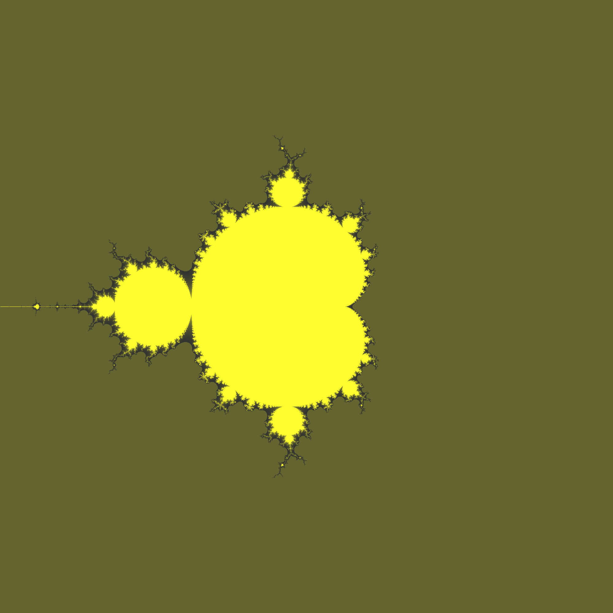

# Generative art using C++


## Build
```
mkdir build
cd build
cmake ../
make
```

## Run
```
./generative_art
// generated_image.ppm will be produced
// Open it using Preview (Mac) or ?(Linux) or ?(Windows)
//
// or use image ImageMagick to convert to png
// convert generated_image.ppm generated_image.png
```
